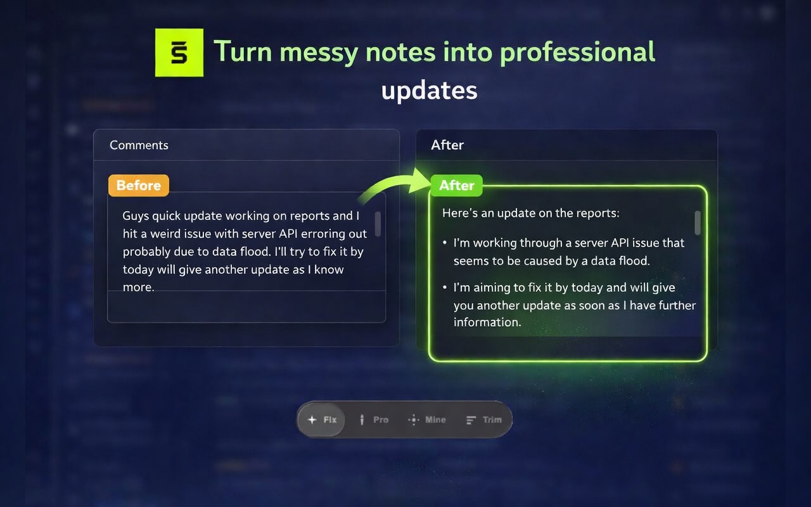

#  Sentō

[](LICENSE)


## Rewrite anywhere

**Sentō** is a Chrome extension that adds a floating AI rewrite bubble to any editable field.
Select text, choose a template, review the result, and apply it instantly.

No copy–paste. No switching tabs. No context loss.

<table><tr><td>



</td><td>


</td></tr></table>

## Key Features

- **Works everywhere**
  Textareas, `contenteditable`, ProseMirror editors, and rich text fields.
  If you can type paragraphs in it, Sentō can rewrite it.

- **Preview before applying**
  Every rewrite shows a preview. Nothing changes until you click **Apply**.
  Enable **Force Insert** in Settings to skip the preview and apply directly.
  Or hold **Shift** when clicking a template for a one-off force apply.

- **Bring your own API key**
  Connect your own OpenAI, Gemini, or Grok API key.
  You pay the provider directly, no subscriptions, no markup.

- **Appears only when needed**
  The rewrite bubble shows only when text is selected.

- **Flexible site control**
  Choose **All Sites**, **Allow List**, or **Block List**.

- **Privacy by design**
  Your API keys stay local and requests go directly to the AI provider.

## Quick Start

### 1. Clone and build

```bash
git clone https://github.com/artttj/sento.git
cd sento
npm install
npm run build
```

### 2. Install the extension

1. Open `chrome://extensions`
2. Enable **Developer mode**
3. Click **Load unpacked**
4. Select the `dist/` folder

### 3. Add your API key

Click the **Sentō icon → Settings → AI Connections**

| Provider | Get a key |
|---|---|
| OpenAI | https://platform.openai.com/api-keys |
| Google Gemini | https://aistudio.google.com/app/apikey |
| Grok (xAI) | https://console.x.ai/ |

## How It Works

1. Select text in any editable field
2. The rewrite bubble appears
3. Choose a template (Fix, Pro, Mine, Trim)
4. Review the rewritten text
5. Click **Apply** or **Retry**

Formatting such as lists and bullet points is preserved, including in editors like Jira, Confluence, and ProseMirror.

## Rewrite Templates

| Template | Purpose |
|---|---|
| **Fix** | Correct grammar, spelling, and clarity |
| **Pro** | Rewrite with a concise professional tone |
| **Mine** | Your custom instruction |
| **Trim** | Shorten text by about 40 percent |

Templates can be reordered, disabled, or customized in **Settings**.

## Languages

The interface currently supports:

- English
- Deutsch (German)

Change it in **Settings → General → Language**.

Prompts sent to AI providers remain in English.

## Common Use Cases

- **Jira / Linear tickets**
  Turn rough notes into a clean update.

- **Email drafts**
  Fix tone and grammar before sending.

- **Slack / Teams messages**
  Rewrite messages for clarity.

- **Code review comments**
  Make suggestions concise and professional.

- **Notion or Markdown writing**
  Improve formatting and readability.

## Privacy and Security

- **Local API keys** — stored only in `chrome.storage.local`
- **Direct requests** — your text goes directly to the AI provider
- **No backend** — Sentō runs entirely client-side

Provider policies: [OpenAI](https://openai.com/policies/privacy-policy/), [Google](https://ai.google.dev/gemini-api/terms), [xAI](https://x.ai/legal/privacy-policy/)

## Tech Stack

- TypeScript (strict mode)
- Chrome Extension Manifest V3
- Shadow DOM UI isolation
- esbuild bundling

## License

MIT — see [LICENSE](LICENSE) for details.
